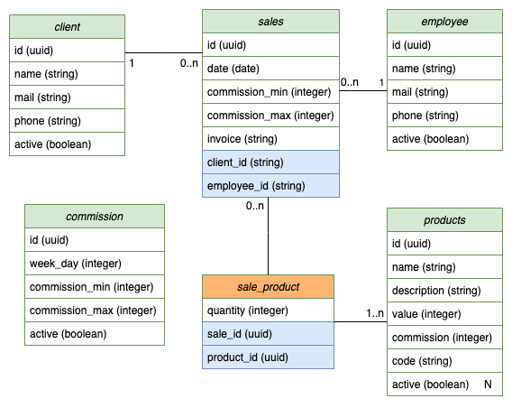

# 🖥️ Backend - Aplicação de Controle de Comissões de uma Papelaria

## 🚀 1 - Requisitos
- **Python**: versão 3.9
- **Banco de Dados**: Postgres ou Docker instalado

## 🛠️ 2 - Rodar o Servidor em Modo de Desenvolvimento

1. **Clonar o Repositório**: 
   Clone o repositório para o seu ambiente local.
   
2. **Acessar o Diretório**: 
   Abra o terminal e navegue até o diretório do repositório clonado.

3. **Configurar o Arquivo `.env`**: 
   - Crie um arquivo `.env`.
   - Copie os dados do `.env.example` para o novo arquivo `.env`.

4. **Configurar o Banco de Dados**: 
   - Configure um banco de dados de acordo com os detalhes do `.env`.
   - Ou crie um container com Postgres utilizando o comando:

   ```bash
   docker run --name papelaria-database -e POSTGRES_PASSWORD=password -p 5432:5432 -d --restart=always postgres
   ```

5. **Criar um Ambiente Virtual**:
   - Crie um ambiente virtual com o comando:

   ```bash
   python -m venv papelaria-env
   ```

   - Ative o ambiente com:

   ```bash
   source papelaria-env/bin/activate
   ```

6. **Instalar Dependências Python**: 
   Instale as bibliotecas de desenvolvimento para compilar módulos Python:

   ```bash
   sudo apt-get install python3.9-dev
   ```

7. **Instalar Pacotes Necessários**:
   - Instale as dependências a partir do arquivo `requirements.txt`:

   ```bash
   pip install -r requirements.txt
   ```

8. **Rodar Script de Configuração**:
   - Execute o script que cria o usuário admin e insere dados de exemplo:

   ```bash
   sh scripts/entrypoint.sh
   ```

9. **Iniciar o Servidor**:
   - Finalmente, inicie o servidor com o comando:

   ```bash
   python manage.py runserver
   ```

10. **Acesso ao Admin**:
    - Acesse o painel administrativo pelo URL: `localhost:8000/admin/`
    - O nome de usuário e senha estão no arquivo `.env`.

---

## 📊 3 - DER (Diagrama Entidade-Relacionamento)



---

## ✅ 4 - Testes Unitários

- Para rodar os testes unitários, execute o comando:

```bash
python manage.py test
```

---

## 🔗 5 - Link frontend
```
https://github.com/mdiori/papelaria-front
```

---

## 📝 6 - Implementações Futuras

- Implementar autenticação para todas as requisições.
- Adicionar documentação da API utilizando Swagger.
- Melhorar apresentação de dados no Django admin.

---

## 📚 7 - Bibliotecas utilizadas

```
# django
Django==4.0.4
django-cors-headers==3.11.0
python-decouple==3.6

# django rest framework
djangorestframework==3.13.1

# postgresql
psycopg2==2.9.3
```

---

# 📋 **Contextualização**

1. O cliente em questão é uma papelaria fictícia que deseja manter um registro de suas vendas e calcular as comissões de seus vendedores com base nas transações realizadas em um determinado período, levando em consideração os percentuais de comissão vinculados aos produtos comercializados.
   
2. Cada produto deve conter as seguintes informações: código, descrição, valor unitário e o percentual de comissão, que pode variar de 0 a 10%.
   
3. As vendas devem registrar o número da nota fiscal, data e hora da transação, o cliente, o vendedor, além de incluir uma lista com um ou mais produtos vendidos e suas respectivas quantidades.

4. Tanto clientes quanto vendedores precisam ter nome, e-mail e telefone registrados.

5. O cálculo da comissão é baseado no percentual cadastrado para o produto e aplicado ao valor total das vendas desse item (quantidade * valor unitário).

6. Em certos dias da semana, os percentuais de comissão têm limites mínimos e máximos. Esses valores podem variar, por isso devem ser configuráveis.  
   - Exemplo: Nas segundas-feiras, o percentual mínimo é 3% e o máximo é 5%. Se um produto tiver uma comissão de 10%, a comissão será limitada a 5% em uma venda nesse dia. Já se o percentual for inferior a 3%, como 2%, será ajustado para 3%.

7. O total da comissão em uma venda será a soma das comissões individuais de cada item vendido.

---

# 📋 **Requisitos do Projeto**

Abaixo estão listados os requisitos funcionais e não funcionais para garantir que o sistema atenda às necessidades do cliente, mantendo qualidade e acessibilidade.

### 🛠️ **Requisitos Funcionais**:
1. **Cadastro de Produtos, Clientes e Vendedores**:
   - 📋 Cadastro via Django Admin.
   - 📦 Produtos devem ter código, descrição, valor unitário e percentual de comissão (0% a 10%).
   - 👥 Clientes e vendedores devem ter nome, e-mail e telefone.

2. **Comissões Configuráveis**:
   - ⚙️ Configurar limites de comissão para dias da semana no Django Admin.

3. **Cálculo de Comissões**:
   - 💰 Cálculo com base no percentual de comissão por produto e quantidade vendida.
   - 🚫 Aplicação de limites de comissão para dias configuráveis.

4. **Registro de Vendas**:
   - 🧾 Registrar vendas com número da nota fiscal, data/hora, cliente, vendedor, e lista de produtos.

5. **Gestão de Vendas**:
   - 📊 Interface para listar, criar, editar e excluir vendas, exibindo data/hora, cliente, vendedor e valor total.

6. **Gestão de Comissões**:
   - 📅 Listagem de vendedores com o total de comissões a serem pagas com base nas vendas de um período.

7. **API REST**:
   - 🌐 Possibilitar CRUD (criação, recuperação, atualização, exclusão) de produtos, clientes, vendedores e vendas.
   - 🔄 Consultar total de comissões dos vendedores por período.

8. **Protótipos**:
   - 🖼️ A interface deve seguir os protótipos criados pela equipe de UX:
     - [Protótipo Navegável](https://www.figma.com/proto/LrQFIRtrRJq1GVzofm07qU/Teste-Python-DEV?page-id=69%3A5896&node-id=830%3A2&viewport=1335%2C779%2C0.5&scaling=min-zoom&starting-point-node-id=830%3A124)
     - [Protótipo Aberto](https://www.figma.com/file/LrQFIRtrRJq1GVzofm07qU/Teste-Python-DEV?node-id=69%3A5896)

---

### 🚀 **Requisitos Não Funcionais**:
1. **Plataforma de Backend**:
   - 🖥️ Uso do **Django** como framework principal.
   - 🗃️ Preferência pelo banco de dados **PostgreSQL**.

2. **Padrões de API**:
   - 🌐 API Restful utilizando corretamente os verbos HTTP.

3. **Repositório Git**:
   - 📂 Código disponível em repositório Git com README contendo instruções claras.

4. **Testes Unitários**:
   - 🧪 O projeto deve conter testes unitários para validar o funcionamento.

5. **Frontend**:
   - 💻 Desenvolver o frontend com **ReactJS** e **JavaScript**.
   - 🔗 Comunicação do frontend com a API para obtenção e envio de dados.

---
